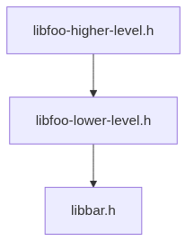
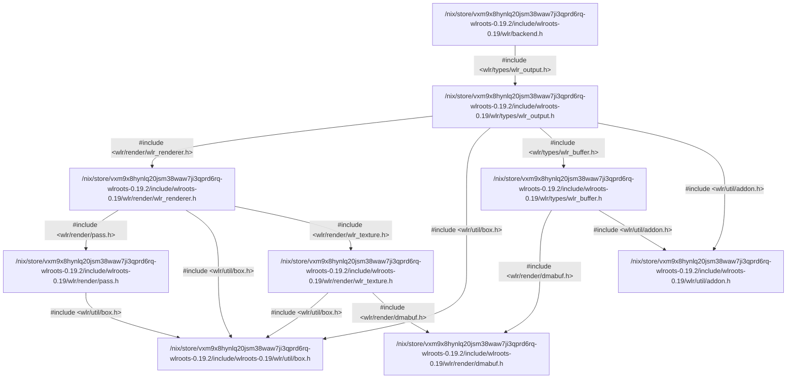
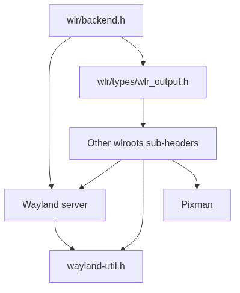

# Generate bindings for `wlroots` (`backend.h`)

`wlroots` is a large project with several dependencies. Therefore, we split the
library into several components. For each component, we separately generate
bindings. We use external binding specifications to inform higher-level
components of types defined in lower-level components.

Run the test application code with

```console
$ nix run
Detected output with description: X11 output 1
```

In the following, we briefly walk through the binding generation process. If you
want to execute the commands yourself, enter a Nix development shell (`nix
develop` or `direnv allow`).

If you are in a development shell, you can also run the test application code
with `cabal run`.

## Include graphs

Include graphs show the inter-dependencies of C header files. Include graphs are
indispensable tools in the process of generating bindings for larger projects
because they give an overview of the header and, in particular also library
inter-dependencies. For example, the C header `libfoo-higher-level.h` may
include (`#include`) another C header `libfoo-lower-level.h`, which in turn may
include another header `libbar.h` from a different library altogether.

<p align="center">
  
</p>

`hs-bindgen` can _generate include graphs for you_. For example, (the last
option is required to satisfy the C preprocessor)

```bash
hs-bindgen-cli info include-graph "wlr/backend.h" --clang-option -DWLR_USE_UNSTABLE
```



We observe:
- The include graph is unwieldy.
- The include graph only shows inter-dependencies of the `wlroots` library, and
not of any other libraries such as `wayland`.

Parse-related `hs-bindgen` flags control which nodes are shown in the include
graph.
- We can add `--parse-all` to include all other library headers, but then the
[include graph is too large](./include-graph-all.mmd) to be of any use to us.
- We can [exclude standard headers by tweaking the parse predicate](./include-graph-no-stdlibs.mmd):

```bash
hs-bindgen-cli info include-graph "wlr/backend.h" --clang-option -DWLR_USE_UNSTABLE \
    --parse-all \
    --parse-except-by-header-path ".*glibc.*" \
    --parse-except-by-header-path ".*clang-wrapper.*"
```

However, even the include graph without standard library headers is large, so we
manually collapsed some nodes (_Wlroots sub-headers_, _Wayland server_, and
_Pixman_):

<p align="center">
  
</p>

We can see that `wayland-util.h` is the core header that the Wayland server as
well as `wlr/backend.h` depend on. Also, we see that Pixman is a dependency of
`wlr/backend.h`, but not of the Wayland server.

Please see the [script generating include graphs](./generate-include-graphs) for the exact commands used.

## Bindings

`wlroots` is a large library and we suggest _separating binding creation_ into
multiple steps or components. `hs-bindgen` uses [_external binding
specifications_](https://github.com/well-typed/hs-bindgen/blob/main/manual/LowLevel/Usage/06-BindingSpecifications.md) to inform higher-level components of the types provided by
lower-level components.

First, we will instruct `hs-bindgen` to translate lower-level library
components, generating external binding specifications for us. We will then use
these external binding specifications when translating higher-level library
components. In fact, `hs-bindgen` does not have hard requirements on how to
"cut" the components (i.e., partition a library). In particular, how C library
code is partitioned into C headers is irrelevant to `hs-bindgen`. Any
declarations available in an external binding specification are used, and
declarations for which no external binding specifications exist will be included
in the current component.

Given the `wlroots` include graph above, we separate binding generation into
five components:
- Wayland utilities (`wayland-util.h`),
- Wayland server (`wayland-server-core.h`) ,
- Pixman (`pixman.h`),
- `wlroots` output type (`wlr/types/wlr_output.h`), and
- `wlroots` backend (`wlr/backend.h`).

First, we use `hs-bindgen` to translate lower-level components such as
`wayland-util.h`, generating external binding specifications with the
`--gen-binding-spec` flag

```bash
hs-bindgen-cli preprocess "wayland-util.h" ... --gen-binding-spec WaylandUtil.yaml
```

Then we instruct `hs-bindgen` to use those binding specifications when
translating higher-level components such as the `wlroots` backend with the
`--external-binding-spec` flag

```bash
hs-bindgen-cli preprocess "wlr/backend.h" ...
        --external-binding-spec WaylandUtil.yaml
        --external-binding-spec WaylandServerCore.yaml
        --external-binding-spec Pixman.yaml
        --external-binding-spec WlrTypesOutput.yaml
```

The [generate-bindings script](./generate-bindings) details all used commands; execute it to
generate bindings for all `wlroots` library components

```bash
./generate-bindings
```

An excerpt of the external binding specifications which `hs-bindgen` generated
for the Wayland server, and which covers the opaque definition of `Wl_event_loop` is

```yaml
version:
  hs_bindgen: 0.1.0
  binding_specification: '1.0'
target: x86_64-pc-linux-gnu
hsmodule: Generated.Wayland.Server.Core
ctypes:
- headers: wayland-server-core.h
  cname: struct wl_event_loop
  hsname: Wl_event_loop
- hsname: Wl_event_loop
  representation: opaque
```

Higher level modules directly use this information, avoiding incompatible
duplicate definitions of data types. For example, `Wlr.Backend.Safe` contains

```haskell
import qualified Generated.Wayland.Server.Core

wlr_backend_autocreate ::
     Ptr Generated.Wayland.Server.Core.Wl_event_loop
  -> Ptr (Ptr Wlr_session)
  -> IO (Ptr Wlr_backend)
wlr_backend_autocreate = ...
```

# Application code

The [application code](./app/Wlroots.hs) briefly creates a `wlroots` backend and prints the
detected output descriptions. Run the application with `cabal run`.

Below, we highlight some features of the generated code.

## Record-dot syntax (zero-copy API)

C structures often contain fields with other C structures which in turn contain
more fields with C structures. For example, the type `Wlr_backend` contains a
field of type `Wlr_backend_events`, which in turn contains a field
`Wlr_backend_events_new_output` of type `Wl_signal`

```haskell
data Wlr_backend = Wlr_backend {
    ...
  , wlr_backend_events :: Wlr_backend_events
  }

data Wlr_backend_events = Wlr_backend_events
    ...
  , wlr_backend_events_new_output :: Wl_signal
  }
```

Further, it is common that we have to deal with pointers to such structures
(e.g., `Ptr Wlr_backend`). `hs-bindgen` provides a user-friendly way to access
inner fields of such pointers, avoiding multiple instanciation of values (which
may involve unnecessary copying of data). The _zero-copy API_ leverages
record-dot syntax

```haskell
backend :: Ptr Wl_backend
backend = ...

newOutputSignal :: Ptr Wl_signal
newOutputSignal = backend.wlr_backend_events.wlr_backend_events_new_output
```

Internally, `hs-bindgen` generates `HasField` instances; a simplified instance
is

```haskell
instance HasField "wlr_backend_events" (Ptr Wlr_backend) (Ptr Wlr_backend_events) where
  getField = ...
```

## Function pointers (higher-order API)

C functions sometimes contain arguments that are pointers to other C functions.
The bindings generated by `hs-bindgen` provide and use a _higher-order API_ that
allows conversion of values representing functions to function pointers that we
can directly pass to C functions. These conversions are encoded in the type
classes `ToFunPtr` and `FromFunPtr` which are exposed by the module
`HsBindgen.Runtime.FunPtr` of the package `hs-bindgen-runtime`.

For example, the `wlroots` test application code creates a listener using the
higher-order API

```haskell
getListener :: IO (Ptr Wl_listener)
getListener = do
  ...
  funPtr <- Wl_notify_func_t <$> toFunPtr handler
  ...
```

Further, `hs-bindgen` generates function pointer variants of all translated
functions. For example, the module `Generated.Wayland.Server.Core.FunPtr`
contains

```haskell
wl_event_loop_destroy :: Ptr.FunPtr ((Ptr.Ptr Wl_event_loop) -> IO ())
wl_event_loop_destroy = ...
```
