# Generate bindings for `wlroots`

`wlroots` is a large project with several dependencies. Therefore, we split the
library into several components. For each component, we separately generate
bindings. We use external binding specifications to inform higher-level
components of types defined in lower-level components.

Run the test application code with

```console
$ nix run
Detected output with description: X11 output 1
```

In the following, we briefly walk through the binding generation process. If you
want to execute the commands yourself, enter a Nix development shell (`nix
develop` or `direnv allow`).

If you are in a development shell, you can also run the test application code
with `cabal run`.

## Include graphs

Include graphs are indispensable tools in the process of generating bindings for
larger projects because they give an overview of the header and library
inter-dependencies. For example, the include graph for `wlroots` without
standard headers and with manually collapsed nodes (_Wlroots sub-headers_,
_Wayland server_, and _Pixman_) is



We can see that `wayland-util.h` is the core header that the Wayland server as
well as `wlroots` depend on. Also, we see that Pixman is a dependency of
`wlroots`, but not of the Wayland server.

[Generate the include graphs](./generate-include-graphs) with

```bash
./generate-include-graphs
```

> [!NOTE]
> The generated include graphs are more verbose versions of the manually edited
> one above.

## Bindings

Given the include graph above, we separate binding generation into five
components:
- Wayland utilities (`wayland-util.h`),
- Wayland server (`wayland-server-core.h`) ,
- Pixman (`pixman.h`),
- `wlroots` output type (`wlr/types/wlr_output.h`), and
- `wlroots` backend (`wlr/backend.h`).

We use [_external binding specifications_](https://github.com/well-typed/hs-bindgen/blob/main/manual/LowLevel/Usage/06-BindingSpecifications.md) to inform higher-level components
of the types provided by lower-level libraries. We generate external binding
specifications for lower-level components such as `wayland-util.h` with the
`--gen-binding-spec` flag, and use those binding specifications in higher-level
components such as the `wlroots` backend with the `--external-binding-spec`
flag. For details, see the [binding generation script](./generate-bindings)

```bash
./generate-bindings
```

For example, an excerpt of the external binding specifications which we
generated for `wayland-util.h`, and which covers the definition of `Wl_message`
is

```yaml
version:
  hs_bindgen: 0.1.0
  binding_specification: '1.0'
target: x86_64-pc-linux-gnu
hsmodule: Generated.Wayland.Util
ctypes:
- headers: wayland-util.h
  cname: struct wl_message
  hsname: Wl_message
- hsname: Wl_message
  representation:
    record:
      constructor: Wl_message
      fields:
      - wl_message_name
      - wl_message_signature
      - wl_message_types
  instances:
  - Eq
  - Show
  - Storable
```

Higher level modules directly use this information, avoiding incompatible
duplicate definitions of data types. For example, `Wayland.Server.Core` contains

```haskell
...

import qualified Generated.Wayland.Util

...

instance HasCField Wl_protocol_logger_message "wl_protocol_logger_message_message" where
  type CFieldType Wl_protocol_logger_message "wl_protocol_logger_message_message" =
    ConstPtr Wl_message

...
```

This code states that the data type `Wl_ptrotocol_logger_message` contains a
field `wl_protocol_logger_message_message` of type `ConstPtr Wl_message`.

# Application code

The [application code](./app/Wlroots.hs) briefly creates a `wlroots` backend and prints the
detected output descriptions. Run the application with `cabal run`.
