# Generate bindings for `wlroots`

`wlroots` is a large project with several dependencies. Therefore, we generate
the bindings using a layered approach with external binding specifications.

Run the test application code with

```console
$ nix run
Detected output with description: X11 output 1
```

In the following, we briefly walk through the binding generation process. If you
want to execute the commands yourself, enter a Nix development shell (`nix
develop` or `direnv allow`).

If you are in a development shell, you can also run the test application code
with `cabal run`.

## Include graphs

Include graphs are indispensable tools in the process of generating bindings for
larger projects because they give an overview of the header and library
inter-dependencies. For example, the include graph for `wlroots` without
standard headers and with manually collapsed nodes (_Wlroots sub-headers_,
_Wayland server_, and _Pixman_) is



We can see that `wayland-util.h` is the core header that the Wayland server as
well as `wlroots` depend on. Also, we see that Pixman is a dependency of
`wlroots`, but not of the Wayland server.

[Generate the include graphs](./generate-include-graphs) with

```bash
./generate-include-graphs
```

> [!NOTE]
> The generated include graphs are more verbose versions of the manually edited
> one above.

## Bindings

Given the include graph above, we separate binding generation into four
sub-modules or layers:
- `wayland-util.h`,
- `wayland-server-core.h`,
- `pixman.h`, and
- `wlroots`.

We generate external binding specifications for lower-level layers such as
`wayland-util.h` with the `--gen-binding-spec` flag, and use those binding
specifications in higher-level layers such as `wlroots` with the
`--external-binding-spec` flag. For details, see the [binding generation
script](./generate-bindings) script

```bash
./generate-bindings
```

