Generate bindings for `wlroots`. `wlroots` is a large project with several
dependencies. Therefor, we generate the bindings using a layered approach with
external binding specifications. In particular, we generate bindings and
external binding specifications for
- `wayland-server-core.h`,
- `pixman.h`, and
- `wlr/backend.h`.

To run the test application code:

```console
$ nix run
Detected output with description: X11 output 1
```

In the following, we briefly walk the user through the binding generation
process.

# Include graphs

Include graphs are indispensable tools in the process of generating bindings for
larger projects because they give an overview of the header and library
inter-dependencies. For example, the include graph for `wlroots` without
standard headers is



Before generating the bindings, have a look at the include graph. The include
graph depicts the library inter-de

Generate bindings:

```bash
./generate-bindings
```


You can also use `cabal run` if you are in the development shell.
