# Generate Haskell bindings from C header files with `hs-bindgen`

## Introduction

In this tutorial, we use
[`hs-bindgen`](https://github.com/well-typed/hs-bindgen) to automatically
generate Haskell bindings for
[`libpcap`](https://github.com/the-tcpdump-group/libpcap), an interface to
various kernel packet capture mechanisms. Further, we use the generated Haskell
bindings to print the list of network devices available on the local machine. We
use the [Nix package manager](https://nixos.org/download/) to manage
installation of `hs-bindgen` and other system dependencies.

### Overview of Method A: Command line client

First, we generate bindings using the `hs-bindgen` client with binary name
`hs-bindgen-cli`. The client generates a set of modules exposing a Haskell
interface to the translated C header files.

We compile our program and link the object files to the shared `libpcap` library
object files which need to be available. That is, while generating the bindings
only requires the C header files to be available, using the generated bindings
requires a (compiled) _implementation_ of the interface defined in the C header
files.

### Overview of Method B: Template Haskell interface

We use the `hs-bindgen` Template Haskell interface. With the Template Haskell
interface, we can directly `#include` the C header files in our Haskell source
code files.

### System environment, LLVM and Nix

`hs-bindgen` uses [`libclang`](https://clang.llvm.org/doxygen/index.html) to
parse and interpret C header files. `libclang` is a part of the [LLVM compiler
infrastructure](https://llvm.org/), which we need to set up and connect to
`hs-bindgen`.

Nix, the package manager and build system, takes care of setting up the Clang
toolchain, the `hs-bindgen` client, and the `hs-bindgen` Template Haskell
interface for us. In particular, this tutorial contains [a minimal Nix
Flake](./flake.nix) exposing `hs-bindgen` the client, and `hs-bindgen` the
Template Haskell interface. This Nix Flake only exports some outputs provided by
an [upstream Nix Flake](https://github.com/dschrempf/hs-bindgen-flake) which we
maintain alongside `hs-bindgen`. You should use this upstream Nix Flake directly
in your future projects, if you decide to use the Nix package manager to manage
your `hs-bindgen` installation.

## Method A: Command line client

### Installation

Install the [Nix package manager](https://nixos.org/download/) and try to build
and run the client with

```console
$ nix run .#hs-bindgen-cli -- --help | head -n 6

hs-bindgen - generate Haskell bindings from C headers

Usage: hs-bindgen [-v|--verbosity INT] [--log-as-info TRACE_ID]
                  [--log-as-warning TRACE_ID] [--log-as-error TRACE_ID]
                  [--log-as-error-warnings] [--log-enable-macro-warnings]
                  [--log-show-time] [--log-show-call-stack] COMMAND
```

The build uses the [default NixOS binary cache](https://cache.nixos.org/), but
some dependencies are `hs-bindgen`-specific and compilation will take a few
minutes. The `hs-bindgen-cli` package derivation uses the default version of GHC
provided by Nixpkgs, and also takes care of installing the default version of
the required parts of the Clang toolchain.

> [!NOTE]
> At the time of writing (September 30, 2025),
> - the default version of GHC is 9.8.4;
> - the Clang toolchain includes version 19.1.7 of packages
>   `llvmPackages.clang`, `llvmPackages.libclang`, and `llvmPackages.llvm`.

> [!TIP]
> - If you want to find out how `hs-bindgen` finds included headers, see the
>   [`hs-bindgen` manual section on
>   includes](https://github.com/well-typed/hs-bindgen/blob/main/manual/LowLevel/Includes.md).
> - If you want to analyze how `hs-bindgen` finds the Clang toolchain, see
>  Section [System environment](#system-environment) of this tutorial.
> - If you want to use a specific version of GHC or the Clang toolchain, [see
>   the relevant section
>   below](#use-specific-versions-of-the-ghc-or-clang-toolchains).

### Whet your appetite!

We have [prepared a small project](./pcap-client) that generates bindings for
`libpcap` and uses them to list the network devices found on your machine.
Change your current working directory to this sub-project:

```console
$ cd pcap-client
```

> [!NOTE]
> We did not check in the generated bindings, but provide a derivation that
> generates the bindings during the build process. That is, you can run the
> application without generating bindings yourself!
>
> ```console
> $ nix run .#hs-pcap
> ```
>
> This should print a list of network devices found on your machine.

### Generate bindings

A Nix development shell provides access to the Haskell toolchain, the
`hs-bindgen` client, the Clang toolchain, and the `libpcap` library (header
files and compiled shared object files). The relevant code from [the Nix
Flake](./pcap-client/flake.nix) is:

```nix
hpkgs.shellFor {
  packages = _: [ hs-pcap ];
  nativeBuildInputs = [
    ...

    # `hs-bindgen` client.
    pkgs.hs-bindgen-cli

    # Connect `hs-bindgen` to the Clang toolchain and `libpcap`.
    pkgs.hsBindgenHook
    pkgs.libpcap
  ];
};
```

Enter the development shell

```console
$ nix develop
```

Let's analyze the environment set up by [`hsBindgenHook`](#hs-bindgen-hook):

```console
$ echo $BINDGEN_EXTRA_CLANG_ARGS
...
-isystem /nix/store/0crnzrvmjwvsn2z13v82w71k9nvwafbd-libpcap-1.10.5/include
...
```

The environment variable `BINDGEN_EXTRA_CLANG_ARGS` is used by `hs-bindgen` and
forwarded to `libclang`.

Then, generate bindings with the provided script:
```console
$ ./generate-bindings
```

The [`generate-bindings` script](./pcap-client/generate-bindings) is well
documented, please have a look at the different command line flags. We generated
the script using an iterative procedure, adding and removing command line flags
as required.

The script should generate several files in folder `./src/Generated/` that you
are encouraged to inspect. In particular, we separate bindings into modules
exposing different binding categories. For example. `./src/Generated/Pcap.hs`
exposes types, whereas `./src/Generated/Pcap/Safe.hs` and
`./src/Generated/Pcap/Unsafe.hs` expose [`safe` and `unsafe` versions of foreign
imports](https://downloads.haskell.org/ghc/latest/docs/users_guide/exts/ffi.html).

### Compile and run `hs-pcap` project

After generating the bindings, compile and run the minimal application using
standard commands. We have prepared a Cabal package:

```console
$ cabal build
...
```

Have a look at the [executable code in `./app/Pcap.hs`](./app/Pcap.hs).

Building the project requires the `libpcap` shared object files. The
`hs-bindgen` hook sets `LD_LIBRARY_PATH` to point to the location of these
files. You can also set `package.extra-include-dirs` and
`package.extra-lib-dirs` stanzas in your `cabal.project` or
`cabal.project.local` file.

On my machine, running the program produces the following output:

```console
$ cabal run
Hello!
List of network devices found on your machine:
  - wlp0s20f3
  - any
  - lo
  - enp0s13f0u3u4u4
  - nflog
  - nfqueue
Bye!
```

### Create and inspect include graph



## Method B: Template Haskell interface

- TH example with default GHC and Clang toolchain versions

## Appendix

### System environment

#### Client wrapper

The Nix Flake wraps the client `hs-bindgen-cli` so that it knows where the Clang
toolchain is installed. We use a binary wrapper, and direct inspection of the
environment is cumbersome. However, we can use `hs-bindgen-cli` itself to report
the system environment it is picking up:

```sh
nix run .#hs-bindgen-cli -- info libclang -v4
```

For example,

```
[Info   ] [HsBindgen] [extra-clang-args] Picked up evironment variable BINDGEN_EXTRA_CLANG_ARGS; parsed 'libclang' arguments: ["-B/nix/store/82kmz7r96navanrc2fgckh2bamiqrgsw-gcc-14.3.0/lib/gcc/x86_64-unknown-linux-gnu/14.3.0","--gcc-toolchain=/nix/store/82kmz7r96navanrc2fgckh2bamiqrgsw-gcc-14.3.0","-B/nix/store/10mkp77lmqz8x2awd8hzv6pf7f7rkf6d-clang-19.1.7-lib/lib","-nostdlibinc","-resource-dir=/nix/store/fbfcll570w9vimfbh41f9b4rrwnp33f3-clang-wrapper-19.1.7/resource-root","-idirafter","/nix/store/gf3wh0x0rzb1dkx0wx1jvmipydwfzzd5-glibc-2.40-66-dev/include","-fmacro-prefix-map=/nix/store/gf3wh0x0rzb1dkx0wx1jvmipydwfzzd5-glibc-2.40-66-dev/include=/nix/store/eeeeeeeeeeeeeeeeeeeeeeeeeeeeeeee-glibc-2.40-66-dev/include","-frandom-seed=76bkkqxi8g"]
[Info   ] [HsBindgen] [builtin-include-dir] BINDGEN_BUILTIN_INCLUDE_DIR set: BuiltinIncDirDisable
```

In particular (see the [Clang command line argument
reference](https://clang.llvm.org/docs/ClangCommandLineReference.html)),

- `-B/nix/store/82kmz7r96navanrc2fgckh2bamiqrgsw-gcc-14.3.0/lib/gcc/x86_64-unknown-linux-gnu/14.3.0`,
  and `--gcc-toolchain=/nix/store/82kmz7r96navanrc2fgckh2bamiqrgsw-gcc-14.3.0`:
  Use and search GCC toolchain for executables, libraries, and data
  files.
- `-B/nix/store/10mkp77lmqz8x2awd8hzv6pf7f7rkf6d-clang-19.1.7-lib/lib`, and
  `-resource-dir=/nix/store/fbfcll570w9vimfbh41f9b4rrwnp33f3-clang-wrapper-19.1.7/resource-root`:
  Use and search the Clang toolchain for executables, libraries, and data files.
  The `resource-dir` is particularly important, because it contains the headers
  of the C standard library. We let `hs-bindgen` know that we specified the
  `resource-dir` directly, so that it does not have to perform heuristic search
  (`BINDGEN_BUILTIN_INCLUDE_DIR=disable` environment variable).
- `-nostdlibinc`: Disable standard system `#include` directories only.
- `-idirafter
  /nix/store/gf3wh0x0rzb1dkx0wx1jvmipydwfzzd5-glibc-2.40-66-dev/include`: Fall
  back to the `glibc` standard library headers.

Other options not discussed here:
`-fmacro-prefix-map=/nix/store/gf3wh0x0rzb1dkx0wx1jvmipydwfzzd5-glibc-2.40-66-dev/include=/nix/store/eeeeeeeeeeeeeeeeeeeeeeeeeeeeeeee-glibc-2.40-66-dev/include`,
and `-frandom-seed=76bkkqxi8g`.

#### `hs-bindgen` hook

We also provide a [setup
hook](https://nixos.org/manual/nixpkgs/stable/#ssec-setup-hooks) that can be
used by projects depending on `hs-bindgen` during their build process. [The
`hs-bindgen` setup
hook](https://github.com/dschrempf/hs-bindgen-flake/blob/main/nix/hs-bindgen/hs-bindgen-hook.sh)
performs the same setup as the wrapper discussed in the section [Client
wrapper](#client-wrapper) above. The `hs-bindgen` setup hook can be used like
other setup hooks by adding it to `buildInputs` or `propagatedBuildInputs`.

To inspect the `hs-bindgen` setup hook, run

```sh
nix build -o hs-bindgen-hook .#hsBindgenHook
cat hs-bindgen-hook/nix-support/setup-hook
```

For example,

```sh
# Populate additional environment variables required by `hs-bindgen`.

# NOTE: Use this setup hook when building packages with `hs-bindgen`. The client
# requires a separate wrapper (doh !) which is defined in `hs-bindgen-cli.nix`.
# Please keep this setup hook and the wrapper synchronized!
populateHsBindgenEnv() {
    # Inform `hs-bindgen` about Nix-specific `CFLAGS` and `CCFLAGS`. In contrast
    # to `rust-bindgen-hook.sh` (see Nixpkgs), we do not set `CXXFLAGS`.
    BINDGEN_EXTRA_CLANG_ARGS="$(</nix/store/fbfcll570w9vimfbh41f9b4rrwnp33f3-clang-wrapper-19.1.7/nix-support/cc-cflags) $(</nix/store/fbfcll570w9vimfbh41f9b4rrwnp33f3-clang-wrapper-19.1.7/nix-support/libc-cflags) $NIX_CFLAGS_COMPILE"
    export BINDGEN_EXTRA_CLANG_ARGS

    # Inform `hs-bindgen` that it does not have to perform heuristic search for
    # the builtin include directory. (We set the builtin include directory using
    # `BINDGEN_EXTRA_CLANG_ARGS`).
    BINDGEN_BUILTIN_INCLUDE_DIR=disable
    export BINDGEN_BUILTIN_INCLUDE_DIR

    # ...
}

postHook="${postHook:-}"$'\n'"populateHsBindgenEnv"$'\n'
```

### Use specific versions of the GHC or Clang toolchains

One possibility to specify the GHC toolchain is to simply use a different
Haskell package set. For example, building the `pcap-client` project with GHC
9.12 only requires a small change in the Nix Flake:

```nix
...
hpkgs = pkgs.haskell.packages.ghc912;
...
```

Changing the version of the Clang toolchain requires an overlay. For example,
using `libclang` version 20 with the `pcap-client` project:

```nix
useLlvm20 = final: prev: {
  llvmPackages = final.llvmPackages_20;
};
pkgs = import nixpkgs {
  inherit system;
  overlays = [
    hs-bindgen.overlays.default
    useLlvm20
  ];
};
```

Note that even when you have `clang` version 19 in your path, `hs-bindgen` uses
`clang` version 20 when the above overlay is activated. You can see this by
inspecting `BINDGEN_EXTRA_CLANG_ARGS` when the development shell is active:

```console
$ echo $BINDGEN_EXTRA_CLANG_ARGS
...
-resource-dir=/nix/store/8s647qbgn3yy2l52ykznsh0xkvgcrqhx-clang-wrapper-20.1.8/resource-root
...
```

## Notes

> [!IMPORTANT]
> Last update: October 2, 2025. The [upstream Nix
> Flake](https://github.com/dschrempf/hs-bindgen-flake) may have received
> updates in the meantime.

## Ideas

- Use `hs-bindgen-cli info include-graph`.
